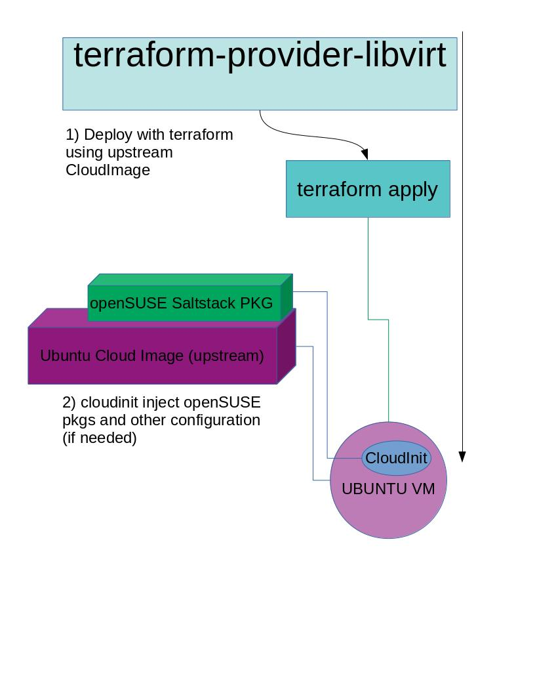
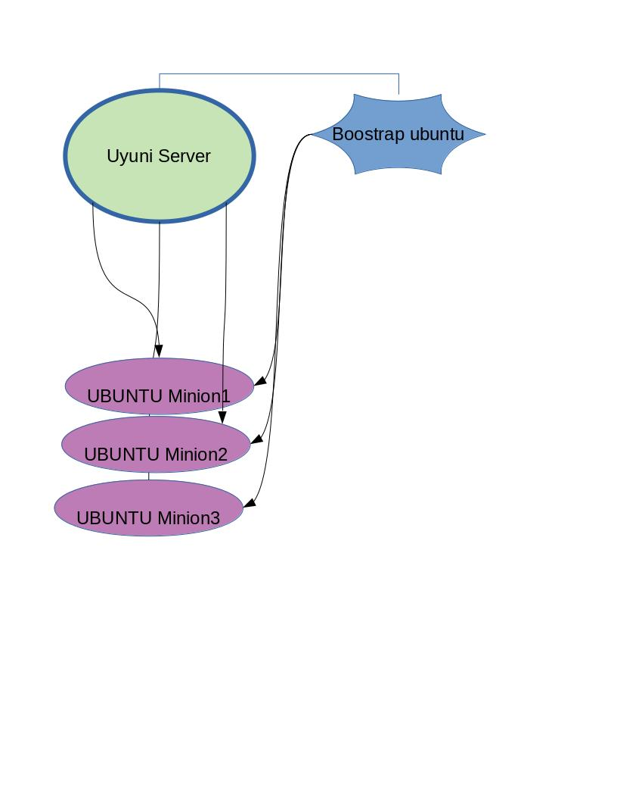

# ubuntu-cloud-image-minion

Welcome to ubuntu-cloud-image-minion project.

This project aims to be minimal and following the UNIX/Linux philosophy: doing only 1 thing, doing it well.

The goal of this project is to deploy with terraform-libvirt-plugin a Ubuntu upstream Cloud Image, and then with help of cloudinit install openSUSE saltstack packages, and other minimal configuration.

Once the VM is created, you can boostrap this VM against your Uyuni-Server. (this is outside the scope of this project)

For this we will use only https://github.com/dmacvicar/terraform-provider-libvirt 

# Installation:

For installing the terraform-libvirt-provider have a look on release:
https://github.com/dmacvicar/terraform-provider-libvirt/releases

You will also need the terraform golang binary.
https://github.com/dmacvicar/terraform-provider-libvirt#installing

You can also use the pkgs https://github.com/dmacvicar/terraform-provider-libvirt#using-packages

## How-to:

once you have terraform and terraform-libvirt-plugin installed run following:

```bash
terraform init
terraform apply
```

And you will have an Ubuntu Instance with openSUSE salt-pkgs.

## Design of this project.



### Additional steps: boostrapping ubuntu image against SUSE-Manager.

Once you have the VM, you can boostrap it against a Uyuni server.

Knowing the Ip of your Ubuntu Server, you can then boostrap the minion against uyuni server ( via gui or CLI). 
This is out of scope of this project.



